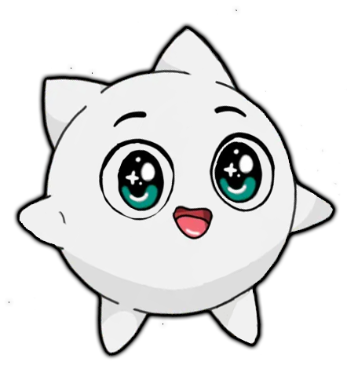

# 🎨 IRYS Avatar Creator - Component Documentation

## Table of Contents

1. [Visual Design System](#visual-design-system)
2. [Layout Components](#layout-components)
3. [Interactive Components](#interactive-components)
4. [Animation Components](#animation-components)
5. [Modal Components](#modal-components)
6. [Styling Reference](#styling-reference)
7. [Responsive Design](#responsive-design)

---

## Visual Design System

### Color Palette

The IRYS Avatar Creator uses a cyberpunk-inspired color scheme with CSS custom properties:

```css
:root {
    --primary: #00f7ff;        /* Cyan - primary accent */
    --primary-dark: #00ccd4;   /* Darker cyan */
    --secondary: #ff00ff;      /* Magenta - secondary accent */
    --accent: #ff4d9e;         /* Pink accent */
    --dark: #0a0a1a;          /* Dark background */
    --darker: #050510;        /* Darker background */
    --light: #e0e0ff;         /* Light text color */
}
```

### Typography

**Font Stack:**
- Primary: `'Poppins', sans-serif` - Modern, clean interface text
- Title: `'Orbitron', monospace` - Futuristic title font
- Code: `'JetBrains Mono', monospace` - Code and technical elements

**Font Weights:**
- Light: 300
- Regular: 400
- Medium: 500
- Semi-bold: 600
- Bold: 700

### Visual Effects

**Gradients:**
```css
/* Primary gradient */
background: linear-gradient(135deg, var(--primary), var(--primary-dark));

/* Multi-color gradient */
background: linear-gradient(45deg, var(--primary), var(--secondary), var(--accent));

/* Radial gradients for backgrounds */
background: radial-gradient(circle at center, var(--darker) 0%, var(--dark) 100%);
```

**Shadows and Glows:**
```css
/* Neon glow effect */
box-shadow: 0 0 30px rgba(0, 247, 255, 0.15);

/* Elevated shadow */
box-shadow: 0 25px 50px rgba(0, 247, 255, 0.25);

/* Text glow */
text-shadow: 0 0 20px rgba(0, 247, 255, 0.8);
```

---

## Layout Components

### 1. Main Container
The primary layout wrapper that centers content and provides responsive behavior.

```html
<div class="container mx-auto p-6">
    <!-- Content -->
</div>
```

**CSS Class:**
```css
.container {
    position: relative;
    z-index: 2;
    max-width: 1200px;
    margin: 0 auto;
    padding: 1.5rem;
}
```

### 2. Avatar Canvas
The central editing area where users create their avatars.

```html
<div id="avatarCanvas" class="avatar-canvas">
    <!-- Draggable elements appear here -->
</div>
```

**Features:**
- **Dimensions:** 500x500px (customizable)
- **Background:** Semi-transparent with blur effect
- **Border:** Animated gradient border
- **Interactions:** Click to deselect elements

**CSS Styling:**
```css
.avatar-canvas {
    background: rgba(20, 20, 40, 0.4);
    border: 2px solid rgba(0, 247, 255, 0.3);
    border-radius: 24px;
    position: relative;
    overflow: hidden;
    width: 500px;
    height: 500px;
    box-shadow: 
        0 0 30px rgba(0, 247, 255, 0.15),
        inset 0 0 30px rgba(0, 247, 255, 0.1);
    backdrop-filter: blur(15px);
    transition: all 0.4s cubic-bezier(0.4, 0, 0.2, 1);
    margin: 0 auto;
}

.avatar-canvas::before {
    content: '';
    position: absolute;
    top: -2px;
    left: -2px;
    right: -2px;
    bottom: -2px;
    background: linear-gradient(45deg, var(--primary), var(--secondary), var(--accent), var(--primary));
    background-size: 400% 400%;
    z-index: -1;
    border-radius: 26px;
    opacity: 0.7;
    animation: gradientBorder 8s ease infinite;
}

.avatar-canvas:hover {
    transform: translateY(-5px);
    box-shadow: 
        0 25px 50px rgba(0, 247, 255, 0.25),
        inset 0 0 40px rgba(0, 247, 255, 0.2);
}
```

### 3. Category Panels
Content panels that display different types of avatar elements.

```html
<div id="emojiPanel" class="content-panel active">
    <div class="emoji-container">
        <div class="grid grid-cols-8 gap-2 max-w-2xl mx-auto mb-4">
            <!-- Emoji items -->
        </div>
    </div>
</div>
```

**Panel Types:**
- **Emoji Panel:** 8-column grid, 200+ emojis
- **Accessory Panel:** 6-column grid, 50+ accessories  
- **Personal Panel:** 4-column grid, user uploads

**CSS Styling:**
```css
.content-panel {
    display: none;
    opacity: 0;
    transform: translateY(20px);
    transition: all 0.3s ease;
}

.content-panel.active {
    display: block;
    opacity: 1;
    transform: translateY(0);
}

.emoji-container, .personal-container {
    background: rgba(15, 15, 35, 0.6);
    border: 1px solid rgba(0, 247, 255, 0.2);
    border-radius: 20px;
    padding: 1.5rem;
    backdrop-filter: blur(10px);
}
```

---

## Interactive Components

### 1. Primary Buttons
Main action buttons with gradient backgrounds and hover effects.

```html
<button class="btn" onclick="uploadImage()">Upload Avatar</button>
<button class="btn-download btn" onclick="downloadAvatar()">Download</button>
```

**CSS Styling:**
```css
.btn {
    font-family: 'Poppins', sans-serif;
    background: linear-gradient(135deg, var(--primary), var(--primary-dark));
    border: none;
    padding: 0.9rem 2rem;
    border-radius: 50px;
    color: #0a0a1a;
    cursor: pointer;
    font-weight: 600;
    font-size: 0.95rem;
    transition: all 0.4s cubic-bezier(0.4, 0, 0.2, 1);
    margin: 0.5rem;
    position: relative;
    overflow: hidden;
    text-transform: uppercase;
    letter-spacing: 0.5px;
}

.btn::before {
    content: '';
    position: absolute;
    top: 0;
    left: -100%;
    width: 100%;
    height: 100%;
    background: linear-gradient(90deg, transparent, rgba(255, 255, 255, 0.3), transparent);
    transition: left 0.5s;
}

.btn:hover::before {
    left: 100%;
}

.btn:hover {
    transform: translateY(-3px);
    box-shadow: 0 10px 25px rgba(0, 247, 255, 0.4);
    background: linear-gradient(135deg, var(--primary-dark), var(--primary));
}

.btn:active {
    transform: translateY(-1px);
}
```

### 2. Category Tabs
Navigation tabs for switching between content categories.

```html
<button class="category-tab active" onclick="showCategory('emojis')" data-category="emojis">
    😀 Emojis
</button>
```

**States:**
- **Active:** Highlighted with primary color
- **Inactive:** Muted with hover effects
- **Hover:** Smooth color transition

**CSS Styling:**
```css
.category-tab {
    background: rgba(30, 30, 50, 0.6);
    border: 2px solid rgba(0, 247, 255, 0.2);
    color: var(--light);
    padding: 0.7rem 1.5rem;
    border-radius: 25px;
    cursor: pointer;
    transition: all 0.3s cubic-bezier(0.4, 0, 0.2, 1);
    font-weight: 500;
    font-size: 0.9rem;
    backdrop-filter: blur(10px);
    position: relative;
    overflow: hidden;
}

.category-tab::before {
    content: '';
    position: absolute;
    top: 0;
    left: 0;
    width: 100%;
    height: 100%;
    background: linear-gradient(135deg, rgba(0, 247, 255, 0.1), rgba(255, 0, 255, 0.1));
    opacity: 0;
    transition: opacity 0.3s ease;
}

.category-tab:hover::before {
    opacity: 1;
}

.category-tab.active {
    background: linear-gradient(135deg, var(--primary), var(--primary-dark));
    color: #0a0a1a;
    border-color: var(--primary);
    transform: translateY(-2px);
    box-shadow: 0 5px 15px rgba(0, 247, 255, 0.3);
}

.category-tab:hover {
    transform: translateY(-2px);
    border-color: var(--primary);
    box-shadow: 0 5px 15px rgba(0, 247, 255, 0.2);
}
```

### 3. Emoji Items
Clickable emoji elements that can be added to the canvas.

```html
<div class="emoji-item" onclick="addIcon('😀')">😀</div>
```

**CSS Styling:**
```css
.emoji-item {
    background: rgba(40, 40, 70, 0.4);
    border: 2px solid rgba(0, 247, 255, 0.2);
    width: 60px;
    height: 60px;
    display: flex;
    align-items: center;
    justify-content: center;
    cursor: pointer;
    transition: all 0.3s cubic-bezier(0.4, 0, 0.2, 1);
    font-size: 24px;
    border-radius: 16px;
    position: relative;
    overflow: hidden;
}

.emoji-item::before {
    content: '';
    position: absolute;
    top: 0;
    left: 0;
    width: 100%;
    height: 100%;
    background: linear-gradient(135deg, rgba(0, 247, 255, 0.2), rgba(255, 0, 255, 0.1));
    opacity: 0;
    transition: opacity 0.3s ease;
}

.emoji-item:hover {
    transform: translateY(-3px) scale(1.1);
    background: rgba(0, 247, 255, 0.2);
    border-color: var(--primary);
    box-shadow: 0 5px 15px rgba(0, 247, 255, 0.2);
}

.emoji-item:hover::before {
    opacity: 1;
}

.emoji-item:active {
    transform: translateY(0) scale(0.95);
}
```

### 4. Draggable Elements
Elements that can be manipulated on the canvas.

```html
<div class="draggable selected" id="element-123">
    😀
    <div class="rotate-handle"></div>
    <div class="resize-handle"></div>
</div>
```

**Features:**
- **Drag:** Move elements around the canvas
- **Rotate:** Cyan handle for rotation
- **Resize:** Orange handle for scaling
- **Select:** Click to show control panel

**CSS Styling:**
```css
.draggable {
    cursor: move;
    user-select: none;
    position: absolute;
    z-index: 10;
    border: 2px solid transparent;
    transition: border-color 0.2s;
    display: flex;
    align-items: center;
    justify-content: center;
}

.draggable:hover {
    border-color: rgba(0, 230, 204, 0.5);
}

.draggable.selected {
    border-color: #00e6cc;
    box-shadow: 0 0 10px rgba(0, 230, 204, 0.5);
}

/* Control Handles */
.rotate-handle {
    position: absolute;
    top: -10px;
    right: -10px;
    width: 20px;
    height: 20px;
    background: #00f7ff;
    border-radius: 50%;
    cursor: pointer;
    opacity: 0;
    transition: opacity 0.2s;
    box-shadow: 0 0 10px rgba(0, 247, 255, 0.7);
}

.resize-handle {
    position: absolute;
    bottom: -10px;
    right: -10px;
    width: 20px;
    height: 20px;
    background: #ff6b35;
    border-radius: 50%;
    cursor: se-resize;
    opacity: 0;
    transition: opacity 0.2s;
    box-shadow: 0 0 10px rgba(255, 107, 53, 0.7);
}

.draggable:hover .rotate-handle,
.draggable:hover .resize-handle,
.draggable.selected .rotate-handle,
.draggable.selected .resize-handle {
    opacity: 1;
}
```

### 5. Control Panel
Side panel for editing selected elements.

```html
<div id="controlPanel" class="control-panel active">
    <h3>Element Controls</h3>
    <!-- Sliders and controls -->
</div>
```

**Location:** Fixed right side
**Visibility:** Appears when element is selected
**Animation:** Slides in from right

**CSS Styling:**
```css
.control-panel {
    position: fixed;
    right: 30px;
    top: 50%;
    transform: translateY(-50%);
    background: rgba(15, 15, 35, 0.7);
    border: 1px solid rgba(0, 247, 255, 0.2);
    border-radius: 24px;
    padding: 1.8rem;
    width: 320px;
    display: none;
    backdrop-filter: blur(20px);
    box-shadow: 
        0 10px 30px rgba(0, 0, 0, 0.4),
        0 0 30px rgba(0, 247, 255, 0.1);
    z-index: 100;
    transition: all 0.4s cubic-bezier(0.4, 0, 0.2, 1);
    opacity: 0;
    transform: translateY(-50%) translateX(20px);
}

.control-panel.active {
    display: block;
    opacity: 1;
    transform: translateY(-50%) translateX(0);
    animation: slideInRight 0.5s cubic-bezier(0.4, 0, 0.2, 1) forwards;
}

.control-panel::before {
    content: '';
    position: absolute;
    top: -2px;
    left: -2px;
    right: -2px;
    bottom: -2px;
    background: linear-gradient(45deg, var(--primary), var(--secondary), var(--accent), var(--primary));
    background-size: 400% 400%;
    z-index: -1;
    border-radius: 26px;
    opacity: 0.3;
    animation: gradientBorder 8s ease infinite;
}

@keyframes slideInRight {
    from { 
        opacity: 0; 
        transform: translateY(-50%) translateX(20px); 
    }
    to { 
        opacity: 1; 
        transform: translateY(-50%) translateX(0); 
    }
}
```

### 6. Range Sliders
Custom-styled sliders for element properties.

```html
<input type="range" id="sizeSlider" min="1" max="500" value="60" 
       oninput="updateSelectedSize(this.value)">
```

**Types:**
- **Size Slider:** 1-500px range
- **Rotation Slider:** 0-360° range  
- **Opacity Slider:** 0-100% range
- **Z-Index Slider:** 1-100 range

**CSS Styling:**
```css
input[type="range"] {
    -webkit-appearance: none;
    width: 100%;
    height: 8px;
    border-radius: 5px;
    background: rgba(40, 40, 70, 0.6);
    outline: none;
    margin: 10px 0;
}

input[type="range"]::-webkit-slider-thumb {
    -webkit-appearance: none;
    appearance: none;
    width: 20px;
    height: 20px;
    border-radius: 50%;
    background: linear-gradient(135deg, var(--primary), var(--primary-dark));
    cursor: pointer;
    box-shadow: 0 0 10px rgba(0, 247, 255, 0.5);
    transition: all 0.2s ease;
}

input[type="range"]::-webkit-slider-thumb:hover {
    transform: scale(1.2);
    box-shadow: 0 0 15px rgba(0, 247, 255, 0.8);
}

input[type="range"]::-moz-range-thumb {
    width: 20px;
    height: 20px;
    border-radius: 50%;
    background: linear-gradient(135deg, var(--primary), var(--primary-dark));
    cursor: pointer;
    border: none;
    box-shadow: 0 0 10px rgba(0, 247, 255, 0.5);
}
```

---

## Animation Components

### 1. Background Particles
Floating animated particles that create atmosphere.

```html
<div class="particles" id="particles">
    <!-- Particles generated by JavaScript -->
</div>
```

**Features:**
- **Count:** 30 particles
- **Animation:** Continuous floating motion
- **Randomization:** Random positions and timing

**CSS Styling:**
```css
.particles {
    position: fixed;
    top: 0;
    left: 0;
    width: 100%;
    height: 100%;
    pointer-events: none;
    z-index: 1;
}

.particle {
    position: absolute;
    width: 4px;
    height: 4px;
    background: rgba(0, 230, 204, 0.6);
    border-radius: 50%;
    animation: float 6s ease-in-out infinite;
}

@keyframes float {
    0%, 100% { 
        transform: translateY(0px) rotate(0deg); 
        opacity: 1; 
    }
    50% { 
        transform: translateY(-100px) rotate(180deg); 
        opacity: 0.5; 
    }
}
```

### 2. 3D IRYS Cube
Animated 3D rotating cube with IRYS letters.

```html
<div class="cube-container">
    <div class="cube">
        <div class="face front">I</div>
        <div class="face back">R</div>
        <div class="face right">Y</div>
        <div class="face left">S</div>
        <div class="face top">✨</div>
        <div class="face bottom">🎨</div>
    </div>
</div>
```

**CSS Styling:**
```css
.cube-container {
    position: fixed;
    top: 20px;
    right: 20px;
    width: 80px;
    height: 80px;
    perspective: 300px;
    z-index: 50;
}

.cube {
    position: relative;
    width: 100%;
    height: 100%;
    transform-style: preserve-3d;
    animation: rotateCube 20s infinite linear;
}

.face {
    position: absolute;
    width: 80px;
    height: 80px;
    background: rgba(0, 247, 255, 0.1);
    border: 2px solid rgba(0, 247, 255, 0.3);
    display: flex;
    align-items: center;
    justify-content: center;
    font-size: 24px;
    font-weight: bold;
    color: var(--primary);
    font-family: 'Orbitron', monospace;
    backdrop-filter: blur(10px);
}

.face.front  { transform: rotateY(0deg) translateZ(40px); }
.face.back   { transform: rotateY(180deg) translateZ(40px); }
.face.right  { transform: rotateY(90deg) translateZ(40px); }
.face.left   { transform: rotateY(-90deg) translateZ(40px); }
.face.top    { transform: rotateX(90deg) translateZ(40px); }
.face.bottom { transform: rotateX(-90deg) translateZ(40px); }

@keyframes rotateCube {
    0% { transform: rotateX(0deg) rotateY(0deg); }
    25% { transform: rotateX(90deg) rotateY(0deg); }
    50% { transform: rotateX(90deg) rotateY(90deg); }
    75% { transform: rotateX(0deg) rotateY(90deg); }
    100% { transform: rotateX(0deg) rotateY(0deg); }
}
```

### 3. Sparait Mascot
Interactive floating mascot character.

```html
<div class="mascot-container" onclick="toggleHelp()">
    
</div>
```

**Features:**
- **Animation:** Continuous floating motion
- **Interaction:** Click to show help
- **Effects:** Glow and hover animations

**CSS Styling:**
```css
.mascot-container {
    position: fixed;
    bottom: 40px;
    left: 40px;
    z-index: 100;
    width: 120px;
    height: 120px;
    display: flex;
    align-items: center;
    justify-content: center;
    cursor: pointer;
    transition: transform 0.3s ease;
}

.mascot {
    max-width: 100%;
    max-height: 100%;
    object-fit: contain;
    filter: drop-shadow(0 0 15px rgba(0, 247, 255, 0.7));
    animation: float 4s ease-in-out infinite;
    transition: transform 0.3s ease, filter 0.3s ease;
}

.mascot-container:hover .mascot {
    transform: scale(1.1);
    filter: drop-shadow(0 0 25px rgba(0, 247, 255, 1));
}

@keyframes float {
    0%, 100% { 
        transform: translateY(0) translateX(0) rotate(0deg); 
        opacity: 0.5; 
    }
    25% { 
        transform: translateY(-20px) translateX(10px) rotate(5deg); 
        opacity: 0.8; 
    }
    50% { 
        transform: translateY(-40px) translateX(-10px) rotate(-5deg); 
        opacity: 0.6; 
    }
    75% { 
        transform: translateY(-20px) translateX(5px) rotate(3deg); 
        opacity: 0.9; 
    }
}
```

### 4. Gradient Animations
Animated background gradients and borders.

```css
@keyframes gradientBG {
    0% { background-position: 0% 50%; }
    50% { background-position: 100% 50%; }
    100% { background-position: 0% 50%; }
}

@keyframes gradientText {
    0% { background-position: 0% 50%; }
    50% { background-position: 100% 50%; }
    100% { background-position: 0% 50%; }
}

@keyframes gradientBorder {
    0% { background-position: 0% 50%; }
    50% { background-position: 100% 50%; }
    100% { background-position: 0% 50%; }
}
```

---

## Modal Components

### 1. Help Modal
Full-screen modal with instructions and tips.

```html
<div id="helpModal" class="help-modal" onclick="closeHelp(event)">
    <div class="help-content">
        <button class="close-help" onclick="closeHelp()">&times;</button>
        <h2>How to Use IRYS Avatar Creator</h2>
        <!-- Help content -->
    </div>
</div>
```

**Features:**
- **Backdrop:** Semi-transparent overlay
- **Content:** Scrollable help text
- **Close:** Click outside or close button

**CSS Styling:**
```css
.help-modal {
    display: none;
    position: fixed;
    z-index: 1000;
    left: 0;
    top: 0;
    width: 100%;
    height: 100%;
    background-color: rgba(0, 0, 0, 0.8);
    backdrop-filter: blur(10px);
    align-items: center;
    justify-content: center;
}

.help-content {
    background: linear-gradient(135deg, rgba(15, 15, 35, 0.95), rgba(25, 25, 45, 0.95));
    border: 2px solid rgba(0, 247, 255, 0.3);
    border-radius: 20px;
    padding: 2rem;
    max-width: 600px;
    max-height: 80vh;
    overflow-y: auto;
    position: relative;
    backdrop-filter: blur(20px);
    box-shadow: 0 20px 60px rgba(0, 0, 0, 0.5);
}

.close-help {
    position: absolute;
    top: 15px;
    right: 20px;
    background: none;
    border: none;
    font-size: 28px;
    color: var(--primary);
    cursor: pointer;
    transition: color 0.3s ease;
}

.close-help:hover {
    color: var(--accent);
    transform: scale(1.1);
}
```

### 2. Tooltips
Hover tooltips for buttons and interactive elements.

```html
<div class="tooltip">
    <button class="btn">Upload Avatar</button>
    <span class="tooltiptext">Upload a base image for your avatar (JPG, PNG)</span>
</div>
```

**CSS Styling:**
```css
.tooltip {
    position: relative;
    display: inline-block;
}

.tooltip .tooltiptext {
    visibility: hidden;
    width: 200px;
    background: rgba(15, 15, 35, 0.95);
    color: var(--light);
    text-align: center;
    border-radius: 10px;
    padding: 8px 12px;
    position: absolute;
    z-index: 1001;
    bottom: 125%;
    left: 50%;
    margin-left: -100px;
    opacity: 0;
    transition: opacity 0.3s;
    font-size: 0.85rem;
    border: 1px solid rgba(0, 247, 255, 0.3);
    backdrop-filter: blur(10px);
    box-shadow: 0 5px 15px rgba(0, 0, 0, 0.3);
}

.tooltip .tooltiptext::after {
    content: "";
    position: absolute;
    top: 100%;
    left: 50%;
    margin-left: -5px;
    border-width: 5px;
    border-style: solid;
    border-color: rgba(15, 15, 35, 0.95) transparent transparent transparent;
}

.tooltip:hover .tooltiptext {
    visibility: visible;
    opacity: 1;
}
```

---

## Styling Reference

### Utility Classes

```css
/* Layout utilities */
.flex { display: flex; }
.justify-center { justify-content: center; }
.items-center { align-items: center; }
.gap-2 { gap: 0.5rem; }
.gap-4 { gap: 1rem; }

/* Grid utilities */
.grid { display: grid; }
.grid-cols-4 { grid-template-columns: repeat(4, minmax(0, 1fr)); }
.grid-cols-6 { grid-template-columns: repeat(6, minmax(0, 1fr)); }
.grid-cols-8 { grid-template-columns: repeat(8, minmax(0, 1fr)); }

/* Spacing utilities */
.p-6 { padding: 1.5rem; }
.m-4 { margin: 1rem; }
.mb-8 { margin-bottom: 2rem; }

/* Text utilities */
.text-center { text-align: center; }
.font-bold { font-weight: 700; }
.uppercase { text-transform: uppercase; }

/* Size utilities */
.w-full { width: 100%; }
.h-full { height: 100%; }
.max-w-2xl { max-width: 42rem; }
.max-w-xl { max-width: 36rem; }
.max-w-lg { max-width: 32rem; }

/* Position utilities */
.relative { position: relative; }
.absolute { position: absolute; }
.fixed { position: fixed; }

/* Display utilities */
.block { display: block; }
.hidden { display: none; }
.opacity-0 { opacity: 0; }
.opacity-100 { opacity: 1; }
```

### Animation Utilities

```css
/* Transition utilities */
.transition-all { transition: all 0.3s ease; }
.transition-colors { transition: color 0.3s ease, background-color 0.3s ease; }
.transition-transform { transition: transform 0.3s ease; }

/* Transform utilities */
.transform { transform: translateZ(0); }
.scale-110 { transform: scale(1.1); }
.rotate-45 { transform: rotate(45deg); }
.translate-y-2 { transform: translateY(0.5rem); }

/* Animation classes */
.animate-pulse { animation: pulse 2s cubic-bezier(0.4, 0, 0.6, 1) infinite; }
.animate-bounce { animation: bounce 1s infinite; }
.animate-spin { animation: spin 1s linear infinite; }
```

### Custom Properties for Theming

```css
/* Override theme colors */
:root {
    --primary: #your-primary-color;
    --secondary: #your-secondary-color;
    --accent: #your-accent-color;
    --dark: #your-dark-color;
    --light: #your-light-color;
}

/* Custom canvas size */
:root {
    --canvas-width: 600px;
    --canvas-height: 600px;
}

/* Custom timing functions */
:root {
    --ease-in-out-cubic: cubic-bezier(0.4, 0, 0.2, 1);
    --ease-out-back: cubic-bezier(0.175, 0.885, 0.32, 1.275);
}
```

---

## Responsive Design

### Breakpoints

```css
/* Mobile devices */
@media (max-width: 640px) {
    .avatar-canvas {
        width: 300px;
        height: 300px;
    }
    
    .control-panel {
        position: fixed;
        bottom: 0;
        right: 0;
        left: 0;
        top: auto;
        transform: none;
        width: 100%;
        border-radius: 20px 20px 0 0;
    }
    
    .grid-cols-8 {
        grid-template-columns: repeat(4, minmax(0, 1fr));
    }
}

/* Tablet devices */
@media (max-width: 768px) {
    .container {
        padding: 1rem;
    }
    
    .social-buttons {
        right: 10px;
        top: 10px;
    }
    
    .mascot-container {
        bottom: 20px;
        left: 20px;
        width: 80px;
        height: 80px;
    }
}

/* Desktop devices */
@media (min-width: 1024px) {
    .avatar-canvas {
        width: 600px;
        height: 600px;
    }
    
    .control-panel {
        width: 380px;
    }
}
```

### Mobile Optimizations

```css
/* Touch-friendly sizing */
@media (max-width: 640px) {
    .emoji-item {
        width: 50px;
        height: 50px;
        font-size: 20px;
    }
    
    .btn {
        padding: 1rem 1.5rem;
        font-size: 1rem;
    }
    
    .category-tab {
        padding: 0.8rem 1.2rem;
        font-size: 0.85rem;
    }
}

/* Improved touch targets */
.draggable .rotate-handle,
.draggable .resize-handle {
    width: 30px;
    height: 30px;
}

@media (max-width: 640px) {
    .draggable .rotate-handle,
    .draggable .resize-handle {
        width: 40px;
        height: 40px;
    }
}
```

---

This comprehensive component documentation covers all visual and interactive elements of the IRYS Avatar Creator. Each component includes detailed styling information, usage examples, and customization options for developers looking to integrate or modify the application.